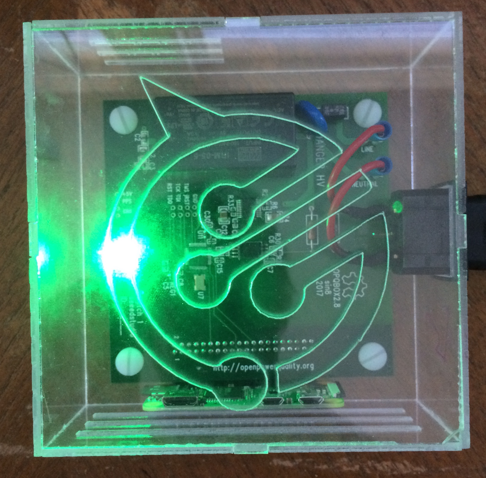
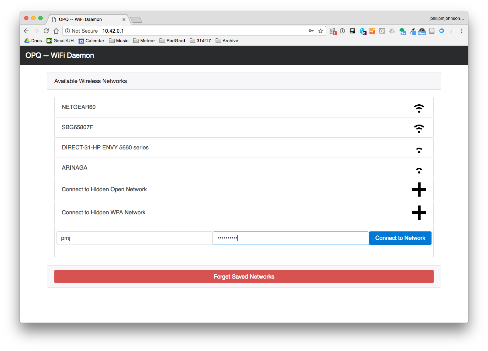
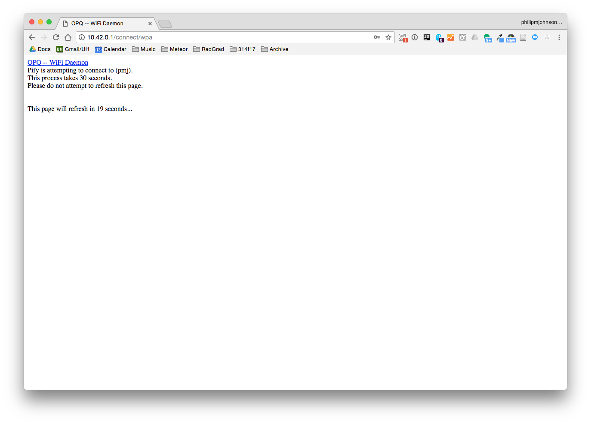
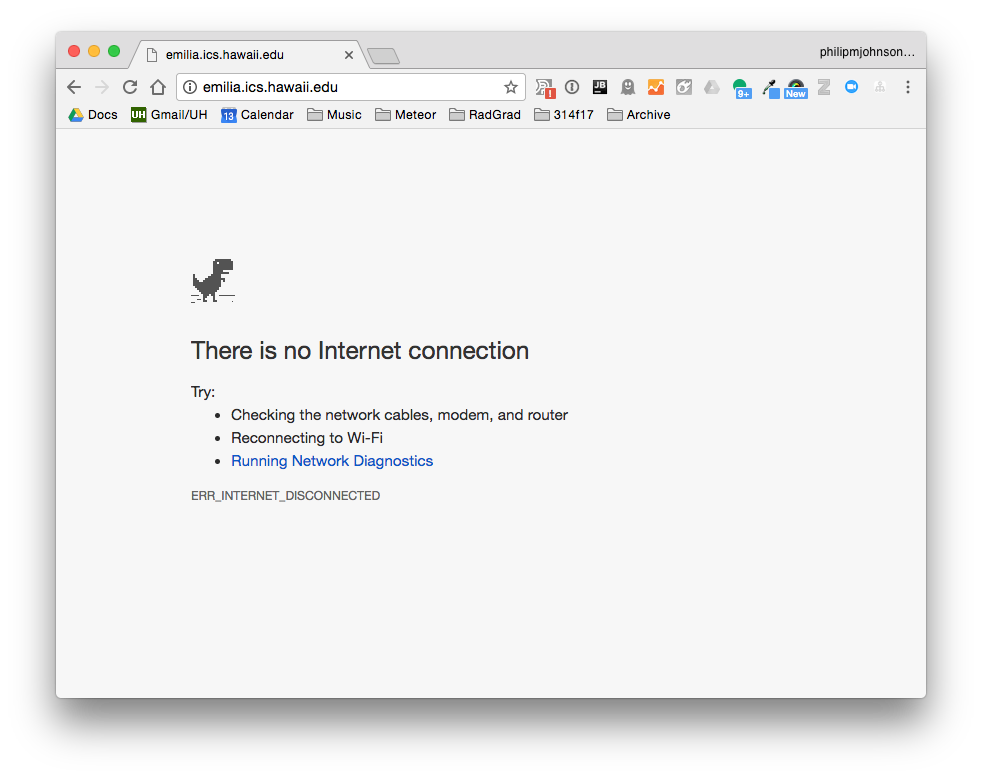
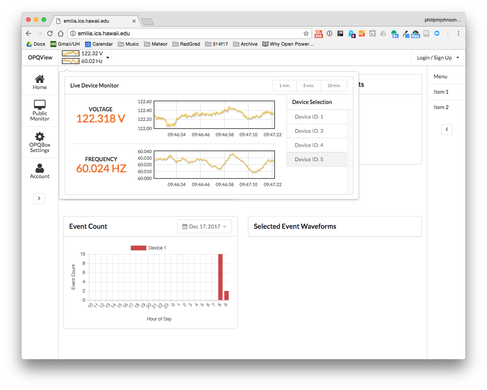

# OPQBox Installation

## Obtain an OPQBox

First, obtain an OPQBox and plug it in within range of a wireless access point. When plugged in, it looks like this:

Currently, your options for obtaining an OPQBox are to contact the Open Power Quality research via Professor Philip Johnson (johnson@hawaii.edu). We are working on manufacturing options. 

## Provide the box with your wireless access credentials

The OPQBox needs to be able to send data to the OPQ cloud services over the Internet. To accomplish this, it needs to know the name and (if required) password for your wireless network.  

To obtain these credentials, you must first wait approximately 30 seconds to a minute after plugging in your OPQBox, at which point you should find that there is a public wireless access point called "OPQ".  Connect to that access point with your laptop.

Once you are connected, bring up a browser and go to `http://10.42.0.1/`.  Your browser should then display a page that lists all the wireless access points found by the OPQBox. Here's an example screen image:
   

You can click either an existing network, or press the "+" buttons to connect to hidden networks.

In this example, the wireless access point of interest (pmj) was hidden, and so the user clicked "Connect to Hidden WPA Network" and then entered the access point name (pmj) and its password in the supplied form fields.

After clicking "Connect to Network", the OPQBox attempts to make the connection, and the following page is displayed:

If the connection is successful, then after 30 seconds, the following page will be displayed:

This page indicates that you should reconnect to your normal wireless network, and check OPQView (currently http://emilia.ics.hawaii.edu) to see if data from your OPQBox is being transmitted successfully

## Verify power quality data transmission

To check your OPQBox is transmitting data successfully to the cloud, connect to your OPQView server and check to see if a device with your box's ID is listed. In this case, the ID is 5, and you can see that data is being sent successfully:

