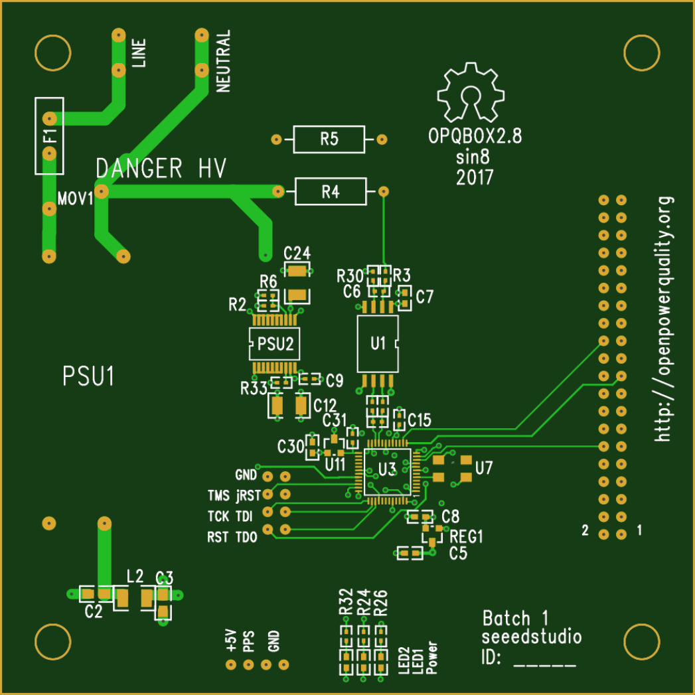
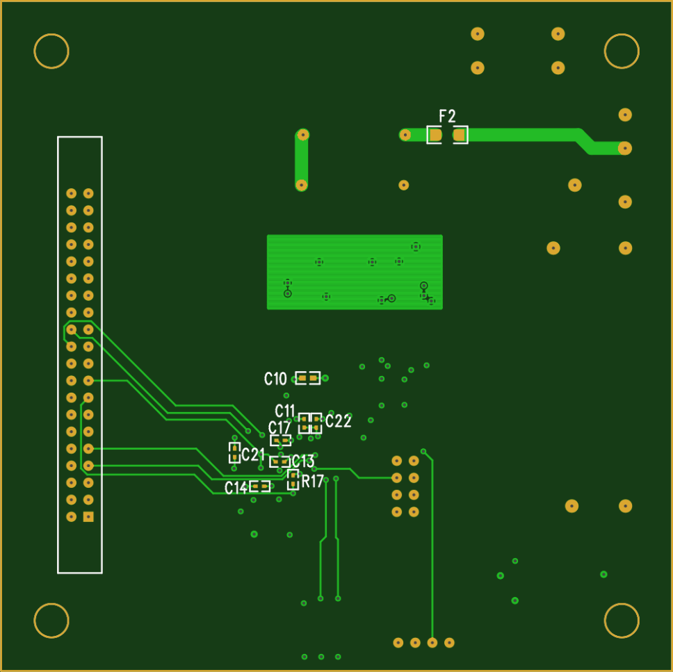

# Manufacturing an OPQ box.

OPQBox manufacture is done in three steps. First, the PCB has to be manufactured via a PCB board house. Next the PCB has to be assembled with the components soldered to it. Finally the enclosure has to be laser cut and glued together.

## PCB manufacture.

A PCB vendor will require you to provide them with the Gerber files, drill file and PCB dimensions. The PCB is a 4 layer 100mm X 100mm board with minimum trace width of 6 mil. The PCB repository contains the latest Gerbers and drill files [here](https://github.com/openpowerquality/opq/tree/master/box/Schematics/Gerbers). Additional this directory contains the the component position [file](https://github.com/openpowerquality/opq/blob/master/box/Schematics/Gerbers/Positions.txt), which will be used for assembly. If your PCB board house provides a gerber preview, make sure that the preview looks similar to the images below:

If you intend to assemble the PCB yourself you may want to create a stencil using the paste mask gerber layers.

## Assembly.

The bill of materials for the OPQ box pcb can be found [here](https://github.com/openpowerquality/opq/blob/master/box/Schematics/BOM.csv). It can be supplied to the assembly house for turn key assembly or used with the component supplier to procure the components. Furthermore the [Positions](https://github.com/openpowerquality/opq/blob/master/box/Schematics/Gerbers/Positions.txt) file contains the positions and orientations for all components.

## Enclosure.

The design for the enclosure panels is available [here](https://github.com/openpowerquality/opq/blob/master/box/Mechanical/opqbox_box.svg). It is meant for being manufactured from 2mm acrylic sheet. We are working on a PCB re-design which will fit a commercially available enclosure.

