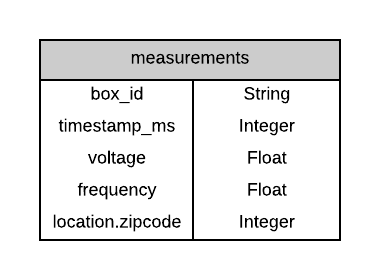
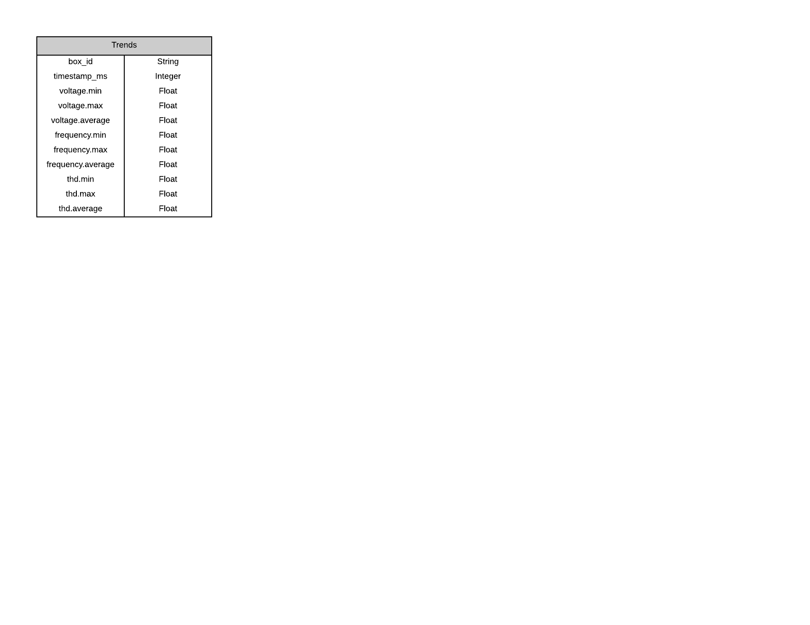
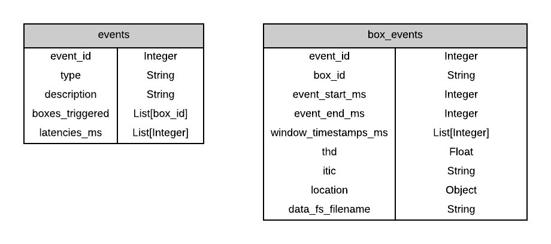
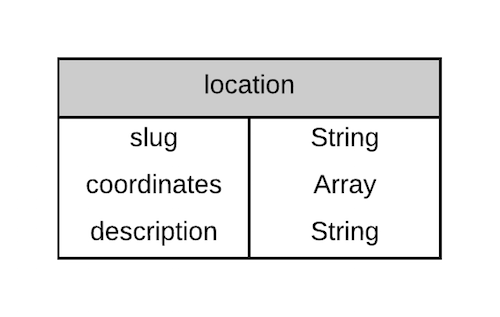
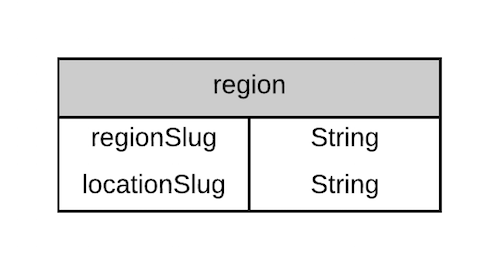
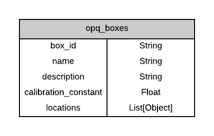
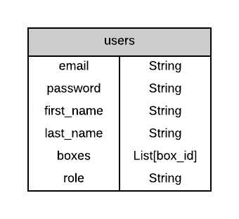

# OPQ Data Model

## Overview {#overview}

At the core of the OPQ system lies a centralized MongoDB database. The majority of this data is produced by the OPQMauka and OPQMakai systems.
The following section will provide a high-level overview of OPQ's data model.

## Data Model

The OPQ system utilizes the following collections:
* **[measurements](#measurements):** Provides short term, low fidelity OPQBox data
* **[trends](#trends):** Provides long term, aggregated OPQBox trend data
* **[events](#events):** Provides high fidelity data (potentially across multiple boxes) regarding anomalies detected by measurements.
* **[box_events](#box_events):** Provides high-fidelity data from a single box. 
* **[fs.files](#fs.files) and [fs.chunks](#fs.chunks)** Internal to GridFS. Stores box_event binary waveform data.
* **[opq_boxes](#opq_boxes):** Provides individual OPQBox information, such as its current (and prior) locations.
* **[users](#users):** Provides user information, such as the boxes currently owned by them.
* **[zipcodes](#zipcodes):** Provides a mapping from zipcode to latitude and longitude.

### Naming Conventions

The OPQ system is comprised of a multitude of different tools, libraries, and frameworks.  In order to minimize confusion, we follow a basic set of naming conventions for our collections and documents that we feel will keep things as simple as possible:

* All collection names and documents fields are in lower-case
* Collection names should always be plural
* Use underscores over camel-case to separate words

### Measurements {#measurements}

The **measurements** collection provides low-fidelity OPQBox snapshot data for a specific moment in time. Documents in this collection are produced at a very rapid rate; OPQMakai requests data from each OPQBox at a rate of six times per second. As such, each measurement document can essentially be thought of as an OPQBox "heartbeat", providing a timestamp and some additional low-fidelity data. Documents are persisted in the collection for a period of 24 hours before expiring.



Each measurement document always corresponds to a single OPQBox, as indicated by the **box_id** field.

The **voltage** and **frequency** fields are RMS calculations of voltage and frequency at the specified moment in time, indicated by the **timestamp_ms** field.

The **thd** field indicates the total harmonic distortion value for this measurement window.

The **expireAt** field that indicates the expiration date of the document. Currently, measurement documents are persisted for a period of 24 hours.

### Trends {#trends}

The **trends** collection provides long term OPQBox trend data. Each trend document represents data aggregated over a one minute data collection window for an individual OPQBox. At first glance, this collection may seem somewhat similar to the *measurements* collection, but there are some key differences between the two: documents in the measurements collection persists for only 24 hours, while documents in the trends collection do not expire. Measurement documents are created at a rate of 6 times per second, per OPQBox - while trend documents are created at a rate of once per minute, per OPQBox.



It's important to note that **voltage**, **frequency**, and **thd** fields are *objects*, each with a **min**, **max**, and **average** sub-property. As each trend document represents one minute's worth of collected OPQBox data, these sub-properties represent the result of data analysis performed within this window.

The **box_id** field indicates the OPQBox from which this data was produced.

The **timestamp_ms** field indicates the (start or end?) timestamp of the collected data.

The **voltage** field is an *object* with **min**, **max**, and **average** sub-fields, which holds the minimum, maximum, and average voltage values encountered over a one minute data collection window.

The **frequency** field is an *object* with **min**, **max**, and **average** sub-fields, which holds the minimum, maximum, and average frequency values encountered over a one minute data collection window.

The **thd** field is an *object* with **min**, **max**, and **average** sub-fields, which holds the minimum, maximum, and average thd values encountered over a one minute data collection window.

### Events and Box Events

When a service (such as Mauka or Makai) notices an anomaly in the measurement data stream it creates an Event document, specifying a set of boxes from which it would like high fidelity data, as well as a time interval for which it would like high fidelity data from each box (if the box has this data avaiable to give).

When a service (such as Mauka or Makai) notices that a new Event document has been created, it then goes and requests high fidelity data from individual boxes.  The data received is stored as Box_Event documents. 

#### Events {#events}

The **events** collection provides events detected by the OPQ System. These documents are generated by OPQMakai after being requested by OPQMauka upon event detection.



The **event_id** field is a unique integer value generated for each event. 

The **type** field indicates the classification of the event, as determined by OPQMauka. Valid event types currently are:

* "FREQUENCY_SAG"
* "FREQUENCY_SWELL"
* "VOLTAGE_SAG"
* "VOLTAGE_SWELL"
* "THD"
* "OTHER"

The **description** field indicates additional information about the event (*Serge: Clarify on this?*)

The **boxes_triggered** array is a list of all OPQBoxes associated with the given event - however it is important to note that this does not always correspond to all of the OPQBoxes for which we have received actual data from for the event.

The **boxes_received** array is a list of all OPQBoxes from which high fidelity data was received for the event.

The **latencies_ms** field is an array of timestamps (milliseconds since epoch) indicating the time when data from each OPQBox was received. Maintains a 1 to 1 correlation with boxes_received. (Update: We removed boxes_received, does it make sense to still have this field?)

The **target_event_start_timestamp_ms** and **target_event_end_timestamp_ms** fields are unix timestamps indicating the requested start time and end time for the high fidelity data.

#### Box Events {#box_events}

The **box_events** collection provides the event meta-data for a given OPQBox.

The **event_id** field corresponds to the event_id generated by the aforementioned **events** document.

The **box_id** field indicates the OPQBox from which this data was produced.

As an event can be associated with multiple OPQBoxes, it is therefore important to understand that there can be (and often are) multiple box_event documents with the same event_id.
Together, the **event_id** and **box_id** fields are what one would query on in order to find data for a given OPQBox for a specific event.

The **event_start_timestamp_ms** and **event_end_timestamp_ms** fields are unix timestamps indicating the start and end time of the event.

The **window_timestamps_ms** field is an array of unix timestamps that correlate with every 2000 samples (10 grid cycles) of recorded box data. This can be useful for debugging purposes, as we can determine the continuity of box data.

The **thd** and **itic** fields correspond to the total harmonic distortion and ITIC values, as calculated by the OPQMauka [THD](../mauka/plugins.md#thd) and [ITIC](../mauka/plugins.md#itic) plugins.

The **location** field is an object indicating OPQBox location information. See [Location](#location) for details.

The **data_fs_filename** field indicates the GridFS filename that holds the box_event's actual raw waveform data.

### GridFS {#gridfs}

[GridFS](https://docs.mongodb.com/manual/core/gridfs/) is a MongoDB specification for storing large documents. As an OPQBox can collect a very large amount of data for each given event (often exceeding the 16 MB MongoDB document size limit), we've opted to utilize GridFS to store our high-fidelity data.
At its core, GridFS is a very simple system consisting of two collections, **fs.files** and **fs.chunks**. 


#### FS.Files {#fs.files}
The **fs.files** collection is internal to GridFS and stores file metadata.
All fields except **metadata.event_id** and **metadata.box_id** are generated by GridFS upon document creation.
Of all these fields internal to GridFS, the most noteworthy is the **filename** field, which corresponds to the box_event's **data_fs_filename** field.

The **metadata.event_id** and **metadata.box_id** fields are used to find the corresponding **box_event** document for which this file holds data for.

Note: The GridFS specification requires the **metadata** field be used to store any external information for the given file document. See [GridFS files.metadata](https://docs.mongodb.com/manual/core/gridfs/#files.metadata)  for more information.

#### FS.Chunks {#fs.chunks}
This collection is internal to GridFS and is used for storing file chunks.
The **files_id** field is a Mongo ObjectID reference to the chunk's corresponding **fs.files** document.
It might be interesting to note that this is the only occurrence in the data model where a Mongo ObjectID is being referenced.


### Locations {#locations}

The **locations** collection provides entities that define locations that can be associated with OPQBoxes, Trends, Events, and other entities in the system.



 Initially, only admins can define locations, and they are defined and managed via the settings.development.json file. Locations have:

  * an array containing longitude and latitude coordinates in that order.
  * a “slug” (a unique, human-friendly string identifier)
  * a string description. 

For example:
```
{ slug: ‘Kailua-PMJ’, coordinates: [-157.751399,  21.409958], description: ‘House in Kailua’ }
```
Note that the coordinates array must list longitude first, then latitude. See [this StackOverflow Question](https://stackoverflow.com/questions/15274834/how-to-store-geospatial-information-in-mongodb) for more details. Mongo has great support for [GeoSpatial queries](https://docs.mongodb.com/manual/geospatial-queries/), so this will be fun to have.

Location slugs should be considered *permanent* once defined.  Since these slugs have the potential to appear in other documents throughout the database, you will have to guarantee that the location does not appear anywhere else in the database in order to delete it.

Likewise, you cannot change the coordinate values willy-nilly.  Only change them if they incorrectly specify the intended location.

### Regions {#regions}

“Regions” represent aggregations of Locations. A region consists of:
  * a region slug
  * a list of location slugs that define the region. 
  


For example, to represent a region called “96734" with three Locations:

```
{ regionSlug: “96734”, locationSlug: “Kailua-PMJ” }
{ regionSlug: “96734”, locationSlug: “Kailua-DJ” }
{ regionSlug: “96734”, locationSlug: “Kailua-KK” }
```

The advantage of this "relational" representation is that it supports many-to-many relationships:

  * a single region can be related to multiple locations (as in the example above), and 

  * a single location can be related to multiple regions (the location “Kailua-PMJ” could be related to the regions “96734", “Oahu”, and “Hawaii”.)

Region and location slugs together constitute a single namespace (i.e. you can’t have two locations or two regions both called “96734”, nor can you have a location called “96734" and a region also called “96734”).

Unlike locations, users can feel free to manipulate region definitions, as they are only used to facilitate UI queries.


### OPQBoxes {#opq_boxes}

The **opq_boxes** collection provides information about each individual OPQBox in the system.



The **box_id** field is a unique string identifier for the OPQBox. This value is always referenced throughout the data model when we need to store a box_id value within a document.

The **name** field is a unique user-friendly string identifier for the OPQBox. Unlike the **box_id** value, which is often used internally throughout the data model, the **name** value should be thought of as the external representation of the OPQBox.

The **description** field is optional and can be used to further describe an OPQBox.

The **calibration_constant** field is the box specific value that is used to adjust the values returned by the ADC so that we get accurate voltage and frequency values.  

The **location** field is a string naming a location slug. This identifies the current location of this box. It is optional.

The **location_start_time_ms** field is a UTC millisecond time stamp indicating the time that data from the current
location began being transmitted. It is optional.

The **location_archive** field is an array containing objects with fields location and location_start_time_ms. This provides a historical record of the locations associated with this box. 

### Users {#users}

Users are represented by three collections: the Users collection (maintained by Meteor, which provides password and basic account information, which is not shown below), UserProfiles (additional profile information), and BoxOwners (which provides a two-way mapping between OPQ Boxes and their owner(s)):



The **email** field is the user's email address. This field also serves as the username to log into OPQView.

The **first_name** and **last_name** fields are the user's first and last name.

The **role** field indicates the role of the user in the OPQ system. Currently, there are only two roles: "user" and "admin".

### Zip Codes {#zipcodes}

The **zipcodes** collection contains a mapping from zip codes to latitude and longitude of the central point of the zip code.

|**zipcodes**|             |
|------------|-------------|
| zipcode (indexed)    | String      |
| latitude   | Float       |
| longitude  | Float       |


