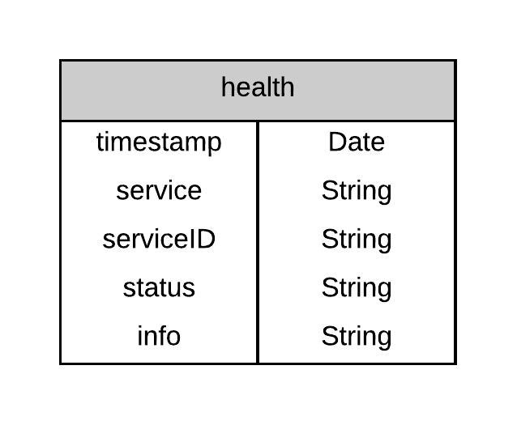

# OPQ Health

## Overview {#overview}

As noted in the [Introduction](../introduction/overview.md), OPQ consists of many interdependent systems, as summarized in this diagram:


For communication between these services, OPQ uses [ZeroMQ](http://zeromq.org/).  

The goal of the OPQHealth service is provide a diagnostic facility for determining whether or not all of the OPQ services appear to be running appropriately.  It does this by monitoring various aspects of the system and publishing its findings to two sources:

  1. The MongoDB database, in a collection called "health".  By storing its findings in MongoDB, OPQHealth enables OPQView to provide an interface to end-users on the health of the network. However, this works only as long as both OPQView and MongoDB are healthy.

  2. A log file. OPQ Health also publishes its findings into a text file. This enables system administrators to diagnose the health of the system even when MongoDB and/or OPQView are down.

## Data Model

OPQHealth creates "entries" representing its findings on the current health of the system that it publishes in two ways: (1) as a single line to its log file, and (2) as a document that it inserts into the MongoDB database. The structure of these entries is summarized in this diagram:



*timestamp*:  Each entry has a timestamp, which is a UTC string indicating the time at which the entry was generated.

*service*:  Indicates the OPQ Service whose status is being described in this entry.  Service should be one of the following: "box", "mauka", "makai", "view", "mongodb" and "health".  Yes, OPQHealth reports on its own health!

*serviceID*:  For some services, such as "box", additional identifying information is required.  The serviceID field provides that information. In the case of OPQBoxes, the serviceID field provides the boxID.

*status*:  Status is either "up" or "down".

*info*: Info is a field that can be used by OPQHealth to provide additional information about an entry.

## Basic operation {#basic-operation}

When OPQHealth starts up, it reads its configuration file to determine what services it should monitor and how frequently it should monitor them.  

Next, it checks each service and writes out an entry to the log file indicating the initial health of each service.

Thereafter, it checks each service at the interval specified in its configuration file.  If the service has not changed its status since the last check (i.e. the service status was "down" and is still "down", or the service status was "up" and is still "up"), then OPQHealth does not publish an entry for that service. If the service *has* changed its status since the last check (i.e. the service was "down" and is now "up", or the service status was "up" and is now "down"), then OPQHealth does publish an entry for that service.  In this way, OPQHealth will publish data that enables users to easily determine which services are up and which are down, as well as how long each service is up before it goes down, as well as how long each service is down before it goes back up.  

OPQHealth also checks its own health in the form of a heartbeat entry.  In its configuration file, there is an entry specifying how frequently OPQHealth should write out an entry about itself.  Under normal circumstances, this heartbeat entry should occur no more than 1-2 times a day in order to keep the size of the log files manageable. System administrators can monitor the log file and/or OPQView to see if OPQHealth has gone down by checking to see if an expected heartbeat entry has not occurred.


## Installation {#installation}

To install OPQHealth, you must first set up the configuration file.  A sample configuration file is in json format and looks like this:

```js
[
  { "service": "zeromq", "port": "tcp://127.0.0.1:9881" },
  { "service": "box", "interval": 60, "boxdata": [ { "boxID": 0 }, { "boxID": 1 }, { "boxID": 3 } ]},
  { "service": "mauka", "interval": 60, "url": "http://localhost:8911", "plugins": ["StatusPlugin", "IticPlugin", "AcquisitionTriggerPlugin", "VoltageThresholdPlugin", "ThdPlugin", "FrequencyThresholdPlugin" ]},
  { "service": "makai", "interval": 60, "mongo": "mongodb://localhost:27017", "acquisition_port": "tcp://localhost:9884" },
  { "service": "view", "interval": 60, "url": "http://emilia.ics.hawaii.edu" },
  { "service": "mongodb", "interval": 60, "url": "mongodb://localhost:27017/" },
  { "service": "health", "interval": 86400 }
]
```

The configuration file is an array of objects.  Every object has a field called "service", which indicates which service the object provides configuration data for.  The remaining fields can vary depending upon the value of the service field.

Most configuration objects have a field called "interval", which specifies the frequency in seconds with which OPQHealth should check on that service. In the example above, most services are checked once a minute, though OPQHealth checks on itself once a day.

To run OPQHealth, cd into the health/ directory and invoke OPQHealth as follows:

```
$ python3 health.py -config configuration.json -log logfile.txt
... reading configuration information from configuration.json
... writing out initial health status to logfile.txt
```

Upon startup, OPQHealth prints out information indicating that it successfully read the configuration file and successfully wrote initial entries to the specified logfile. Afterwards, it does not write anything to the console. Here is an example of the log file after startup:

```
20180318-09:08:23-10:00 service: health, serviceID:, status: up, info: initial startup
20180318-09:08:21-10:00 service: box, serviceID: 0, status: up, info:
20180318-09:08:21-10:00 service: box, serviceID: 1, status: up, info:   
20180318-09:08:22-10:00 service: box, serviceID: 2, status: down, info:   
20180318-09:08:22-10:00 service: mauka, serviceID:, status: up, info:   
20180318-09:08:22-10:00 service: makai, serviceID:, status: up, info:   
20180318-09:08:22-10:00 service: mongodb, serviceID:, status: up, info:   
20180318-09:08:22-10:00 service: view, serviceID:, status: up, info:   
```

The log file prints out the value of all fields in the data model, comma separated. It always prints out the status of health first upon startup, with an info field value of "initial startup".

Note that there will be no further lines written to the file until the box with id 2 comes up, or any of the other services goes down, or a day has passed, at which point an additional line will be appended indicating that health is still up:

```
20180319-09:08:23-10:00 service: health, serviceID:, status: up, info:
```

Of course, the actual elapsed time between these heartbeat log entries for the health system depend upon the value provided in the configuration file.

Note that each time an entry is added to the log file, a corresponding document is inserted into the health collection.

## Detecting health

OPQHealth assesses the health of each service in the following way:

*OPQ Box*:  For an OPQBox to have status "up", it must have sent at least one message to the ZeroMQ service within the past 5 minutes.

*Mauka*: For Mauka to have the status up, Mauka's health http endpoint must respond with status code 200 and valid json containing a dict of plugins and a timestamp for each of the plugin's last "heartbeat." Each Mauka plugin will have its own health status, which is considered up if its provided timestamp is within the past 5 minutes. A health status is only provided for plugins specified in the config.json

*Makai*: For Makai to have the status up, three things must happen. (1) Boxes must be sending measurements. (2) Must be able to request events from Makai's acquisition broker. (3) The requested event must appear in mongodb.

*MongoDB*: For MongoDB to have status up, OPQHealth must be able to successfully retrieve a document from the health collection.

*View*: For OPQView to have status "up", OPQHealth must be able to retrieve the landing page with status 200.
