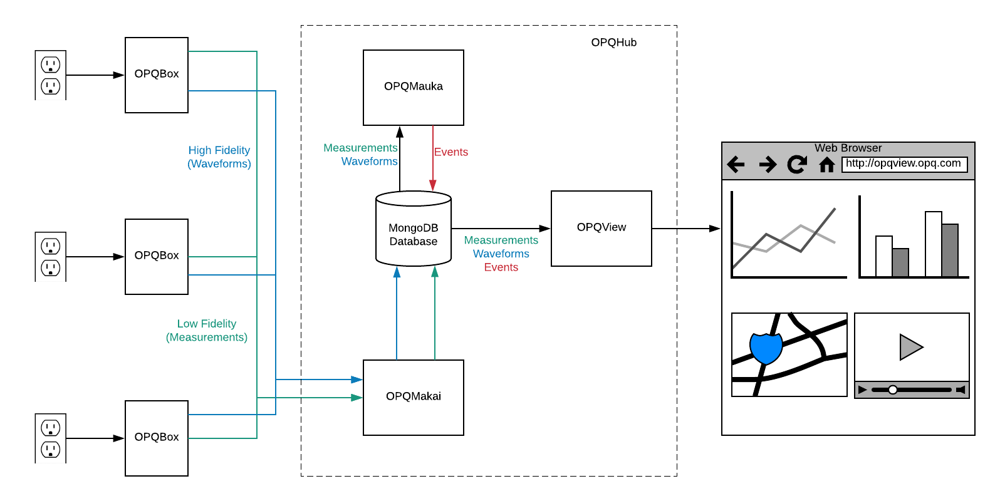

# OPQ System Overview

The OPQ system consists of four major open source hardware and software components that provide end-to-end support for the capture, triggering, analysis, and reporting of consumer level local and global PQ events. 

  1. OPQBox is a hardware device that detects the electrical waveform from a standard residential outlet and communicates both low and high fidelity representations of the waveform to other OPQ system components. 
  2. OPQMakai monitors incoming low fidelity data from OPQBoxes, requests high fidelity data when necessary, and stores the results in a MongoDB database.
  3. OPQMauka analyzes data, creates "events" when it detects anomolies, and can tell OPQMakai to request high fidelity data from one or more OPQBoxes to facilitate analysis.
  4. OPQView is a visualization platform for displaying the results for data capture and analysis.
  

The following image illustrates how these components work together to take information from wall outlets (on the left side) to the display of analyses in a browser (on the right hand side):

This image illustrates the following high level data and control flow:

  * OPQBoxes analyze power from wall outlets, and send low fidelity measurements to OPQMakai.
  * OPQMakai analyzes low fidelity measurements, and requests high fidelity waveforms when desirable.
  * Both measurements and waveforms are saved in a MongoDB database.
  * OPQMauka analyzes low and high fidelity data, and creates "events" to represent anomalies.
  * OPQView notifies users of events and allows them to drill down into low and high fidelity data.
  
OPQMakai, OPQMauka, and OPQView are all cloud-based software services that collectively form a single "instance" with respect to data transmission, storage, analysis, and visualization.  We refer to this collection of software-side components as OPQCloud.  Every OPQBox connects to a single instance of an OPQCloud.  It is possible to have multiple OPQCloud instances. For example, a company might install an OPQCloud instance behind their firewall along with OPQBoxes to provide a private mechanism for collecting and analyzing power quality data. 
  
Our approach has a number of benefits. The combination of low and high fidelity data reduces both network overhead and storage requirements, which increases the scalability of the system in terms of the number of OPQBoxes that can be tied to a single OPQCloud instance. OPQMakai and OPQMauka have a plugin architecture, making it easier to extend their functionality to incorporate new triggers for high quality data (in the case of OPQMakai) and new events and analyses (in the case of OPQMauka). Finally, the open source licensing of both hardware and software makes it possible to incorporate new ideas, bug fixes, and enhancements from technologists across the power quality community.
