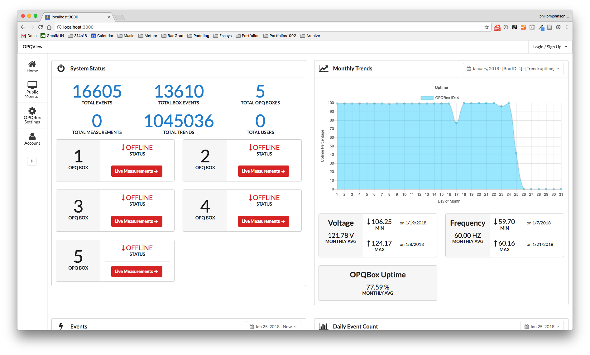

# OPQView Installation

## Installation

First, [install Meteor](https://www.meteor.com/install).

Second, [download a copy of OPQ](https://github.com/openpowerquality/opq/archive/master.zip), or clone it using git.

Third, [install MongoDB](https://docs.mongodb.com/manual/installation/).  Even though Meteor comes with a copy of Mongo, you will need to install MongoDB again in order to run the mongorestore command. 
  
Fourth, cd into the app/ directory and install libraries with:

```
$ meteor npm install
```

Then, download the latest OPQ mongodump file at:
Unpack the tar.gz, place the opq folder into the view directory.
Before we can run the mongorestore command, we must run the local Meteor application so that its MongoDB instance is
running. In order to do this, run the app with:
```
meteor npm run start
```
And then in another terminal window, cd to the same directory where the opq dump file is located, and run:

```
mongorestore -h 127.0.0.1 --port 3001 --gzip -d meteor opq
```

Here is the sample output from a run of mongorestore. It takes around 3 minutes on a late model Mac laptop:

```
mongorestore -h 127.0.0.1 --port 3001 --gzip -d meteor opq
2018-01-29T14:50:49.999-1000	the --db and --collection args should only be used when restoring from a BSON file. Other uses are deprecated and will not exist in the future; use --nsInclude instead
2018-01-29T14:50:49.999-1000	building a list of collections to restore from opq dir
2018-01-29T14:50:50.001-1000	reading metadata for meteor.fs.chunks from opq/fs.chunks.metadata.json.gz
2018-01-29T14:50:50.001-1000	reading metadata for meteor.trends from opq/trends.metadata.json.gz
2018-01-29T14:50:50.001-1000	reading metadata for meteor.box_events from opq/box_events.metadata.json.gz
2018-01-29T14:50:50.001-1000	reading metadata for meteor.measurements from opq/measurements.metadata.json.gz
2018-01-29T14:50:50.089-1000	restoring meteor.fs.chunks from opq/fs.chunks.bson.gz
2018-01-29T14:50:50.158-1000	restoring meteor.box_events from opq/box_events.bson.gz
2018-01-29T14:50:50.217-1000	restoring meteor.trends from opq/trends.bson.gz
2018-01-29T14:50:50.277-1000	restoring meteor.measurements from opq/measurements.bson.gz
2018-01-29T14:50:52.994-1000	[........................]     meteor.fs.chunks   15.7MB/632MB   (2.5%)
2018-01-29T14:50:52.994-1000	[#######.................]    meteor.box_events  30.1MB/92.8MB  (32.4%)
2018-01-29T14:50:52.994-1000	[##......................]        meteor.trends  3.36MB/37.5MB   (8.9%)
2018-01-29T14:50:52.994-1000	[#.......................]  meteor.measurements  1.89MB/37.3MB   (5.1%)
2018-01-29T14:50:52.994-1000	
2018-01-29T14:50:55.994-1000	[#.......................]     meteor.fs.chunks   30.7MB/632MB   (4.8%)
2018-01-29T14:50:55.994-1000	[##############..........]    meteor.box_events  56.8MB/92.8MB  (61.2%)
2018-01-29T14:50:55.994-1000	[####....................]        meteor.trends  6.33MB/37.5MB  (16.9%)
2018-01-29T14:50:55.994-1000	[##......................]  meteor.measurements  3.62MB/37.3MB   (9.7%)
2018-01-29T14:50:55.994-1000	
2018-01-29T14:50:58.992-1000	[#.......................]     meteor.fs.chunks   44.9MB/632MB   (7.1%)
2018-01-29T14:50:58.992-1000	[######################..]    meteor.box_events  85.4MB/92.8MB  (92.0%)
2018-01-29T14:50:58.992-1000	[#####...................]        meteor.trends  9.09MB/37.5MB  (24.2%)
2018-01-29T14:50:58.992-1000	[###.....................]  meteor.measurements  5.11MB/37.3MB  (13.7%)
2018-01-29T14:50:58.992-1000	
2018-01-29T14:51:00.262-1000	[########################]  meteor.box_events  92.8MB/92.8MB  (100.0%)
2018-01-29T14:51:00.262-1000	restoring indexes for collection meteor.box_events from metadata
2018-01-29T14:51:00.858-1000	finished restoring meteor.box_events (13610 documents)
2018-01-29T14:51:00.858-1000	reading metadata for meteor.fs.files from opq/fs.files.metadata.json.gz
2018-01-29T14:51:00.976-1000	restoring meteor.fs.files from opq/fs.files.bson.gz
2018-01-29T14:51:01.801-1000	restoring indexes for collection meteor.fs.files from metadata
2018-01-29T14:51:01.992-1000	[#.......................]     meteor.fs.chunks   52.4MB/632MB   (8.3%)
2018-01-29T14:51:01.992-1000	[######..................]        meteor.trends  10.4MB/37.5MB  (27.9%)
2018-01-29T14:51:01.992-1000	[###.....................]  meteor.measurements  5.88MB/37.3MB  (15.8%)
2018-01-29T14:51:01.992-1000	
2018-01-29T14:51:02.095-1000	finished restoring meteor.fs.files (13610 documents)
2018-01-29T14:51:02.096-1000	reading metadata for meteor.events from opq/events.metadata.json.gz
2018-01-29T14:51:02.144-1000	restoring meteor.events from opq/events.bson.gz
2018-01-29T14:51:02.793-1000	restoring indexes for collection meteor.events from metadata
2018-01-29T14:51:03.004-1000	finished restoring meteor.events (16605 documents)
2018-01-29T14:51:03.004-1000	reading metadata for meteor.opq_boxes from opq/opq_boxes.metadata.json.gz
2018-01-29T14:51:03.051-1000	restoring meteor.opq_boxes from opq/opq_boxes.bson.gz
2018-01-29T14:51:03.054-1000	restoring indexes for collection meteor.opq_boxes from metadata
2018-01-29T14:51:03.106-1000	finished restoring meteor.opq_boxes (5 documents)
2018-01-29T14:51:03.106-1000	reading metadata for meteor.meteor_accounts_loginServiceConfiguration from opq/meteor_accounts_loginServiceConfiguration.metadata.json.gz
2018-01-29T14:51:03.108-1000	restoring meteor.meteor_accounts_loginServiceConfiguration from opq/meteor_accounts_loginServiceConfiguration.bson.gz
2018-01-29T14:51:03.110-1000	restoring indexes for collection meteor.meteor_accounts_loginServiceConfiguration from metadata
2018-01-29T14:51:03.111-1000	finished restoring meteor.meteor_accounts_loginServiceConfiguration (0 documents)
2018-01-29T14:51:03.111-1000	reading metadata for meteor.roles from opq/roles.metadata.json.gz
2018-01-29T14:51:03.112-1000	restoring meteor.roles from opq/roles.bson.gz
2018-01-29T14:51:03.115-1000	restoring indexes for collection meteor.roles from metadata
2018-01-29T14:51:03.116-1000	finished restoring meteor.roles (0 documents)
2018-01-29T14:51:03.117-1000	reading metadata for meteor.users from opq/users.metadata.json.gz
2018-01-29T14:51:03.117-1000	restoring meteor.users from opq/users.bson.gz
2018-01-29T14:51:03.120-1000	restoring indexes for collection meteor.users from metadata
2018-01-29T14:51:03.122-1000	finished restoring meteor.users (0 documents)
2018-01-29T14:51:04.991-1000	[##......................]     meteor.fs.chunks   67.0MB/632MB  (10.6%)
2018-01-29T14:51:04.991-1000	[########................]        meteor.trends  13.1MB/37.5MB  (34.9%)
2018-01-29T14:51:04.991-1000	[####....................]  meteor.measurements  7.31MB/37.3MB  (19.6%)
2018-01-29T14:51:04.991-1000	
2018-01-29T14:51:07.991-1000	[###.....................]     meteor.fs.chunks   83.1MB/632MB  (13.1%)
2018-01-29T14:51:07.991-1000	[##########..............]        meteor.trends  16.5MB/37.5MB  (44.0%)
2018-01-29T14:51:07.991-1000	[#####...................]  meteor.measurements  9.21MB/37.3MB  (24.7%)
2018-01-29T14:51:07.991-1000	
2018-01-29T14:51:10.991-1000	[###.....................]     meteor.fs.chunks   98.3MB/632MB  (15.6%)
2018-01-29T14:51:10.991-1000	[############............]        meteor.trends  19.9MB/37.5MB  (53.2%)
2018-01-29T14:51:10.991-1000	[#######.................]  meteor.measurements  11.0MB/37.3MB  (29.5%)
2018-01-29T14:51:10.991-1000	
2018-01-29T14:51:13.994-1000	[####....................]     meteor.fs.chunks    113MB/632MB  (17.9%)
2018-01-29T14:51:13.994-1000	[##############..........]        meteor.trends  23.0MB/37.5MB  (61.2%)
2018-01-29T14:51:13.994-1000	[########................]  meteor.measurements  12.6MB/37.3MB  (33.7%)
2018-01-29T14:51:13.994-1000	
2018-01-29T14:51:16.995-1000	[####....................]     meteor.fs.chunks    130MB/632MB  (20.6%)
2018-01-29T14:51:16.995-1000	[################........]        meteor.trends  26.3MB/37.5MB  (70.1%)
2018-01-29T14:51:16.995-1000	[#########...............]  meteor.measurements  14.5MB/37.3MB  (38.8%)
2018-01-29T14:51:16.995-1000	
2018-01-29T14:51:19.991-1000	[#####...................]     meteor.fs.chunks    148MB/632MB  (23.4%)
2018-01-29T14:51:19.991-1000	[###################.....]        meteor.trends  30.1MB/37.5MB  (80.3%)
2018-01-29T14:51:19.991-1000	[##########..............]  meteor.measurements  16.6MB/37.3MB  (44.4%)
2018-01-29T14:51:19.991-1000	
2018-01-29T14:51:22.995-1000	[######..................]     meteor.fs.chunks    165MB/632MB  (26.1%)
2018-01-29T14:51:22.995-1000	[#####################...]        meteor.trends  33.5MB/37.5MB  (89.3%)
2018-01-29T14:51:22.995-1000	[###########.............]  meteor.measurements  18.3MB/37.3MB  (49.0%)
2018-01-29T14:51:22.995-1000	
2018-01-29T14:51:25.940-1000	[########################]  meteor.trends  37.5MB/37.5MB  (100.0%)
2018-01-29T14:51:25.940-1000	restoring indexes for collection meteor.trends from metadata
2018-01-29T14:51:25.992-1000	[######..................]     meteor.fs.chunks    182MB/632MB  (28.7%)
2018-01-29T14:51:25.992-1000	[############............]  meteor.measurements  20.2MB/37.3MB  (54.1%)
2018-01-29T14:51:25.992-1000	
2018-01-29T14:51:28.993-1000	[######..................]     meteor.fs.chunks    182MB/632MB  (28.7%)
2018-01-29T14:51:28.993-1000	[############............]  meteor.measurements  20.2MB/37.3MB  (54.1%)
2018-01-29T14:51:28.993-1000	
2018-01-29T14:51:31.901-1000	finished restoring meteor.trends (1045036 documents)
2018-01-29T14:51:31.994-1000	[######..................]     meteor.fs.chunks    182MB/632MB  (28.9%)
2018-01-29T14:51:31.994-1000	[#############...........]  meteor.measurements  20.3MB/37.3MB  (54.4%)
2018-01-29T14:51:31.994-1000	
2018-01-29T14:51:34.991-1000	[#######.................]     meteor.fs.chunks    201MB/632MB  (31.8%)
2018-01-29T14:51:34.991-1000	[##############..........]  meteor.measurements  23.1MB/37.3MB  (61.8%)
2018-01-29T14:51:34.991-1000	
2018-01-29T14:51:37.991-1000	[########................]     meteor.fs.chunks    217MB/632MB  (34.4%)
2018-01-29T14:51:37.991-1000	[################........]  meteor.measurements  25.7MB/37.3MB  (68.8%)
2018-01-29T14:51:37.991-1000	
2018-01-29T14:51:40.994-1000	[#########...............]     meteor.fs.chunks    238MB/632MB  (37.6%)
2018-01-29T14:51:40.994-1000	[##################......]  meteor.measurements  29.0MB/37.3MB  (77.7%)
2018-01-29T14:51:40.994-1000	
2018-01-29T14:51:43.992-1000	[#########...............]     meteor.fs.chunks    256MB/632MB  (40.5%)
2018-01-29T14:51:43.992-1000	[####################....]  meteor.measurements  32.1MB/37.3MB  (86.0%)
2018-01-29T14:51:43.992-1000	
2018-01-29T14:51:46.993-1000	[##########..............]     meteor.fs.chunks    273MB/632MB  (43.1%)
2018-01-29T14:51:46.993-1000	[######################..]  meteor.measurements  34.8MB/37.3MB  (93.1%)
2018-01-29T14:51:46.993-1000	
2018-01-29T14:51:49.652-1000	[########################]  meteor.measurements  37.3MB/37.3MB  (100.0%)
2018-01-29T14:51:49.652-1000	restoring indexes for collection meteor.measurements from metadata
2018-01-29T14:51:49.993-1000	[###########.............]  meteor.fs.chunks  293MB/632MB  (46.3%)
2018-01-29T14:51:52.991-1000	[###########.............]  meteor.fs.chunks  314MB/632MB  (49.6%)
2018-01-29T14:51:55.994-1000	[############............]  meteor.fs.chunks  333MB/632MB  (52.7%)
2018-01-29T14:51:58.851-1000	finished restoring meteor.measurements (2034493 documents)
2018-01-29T14:51:58.993-1000	[#############...........]  meteor.fs.chunks  356MB/632MB  (56.3%)
2018-01-29T14:52:01.992-1000	[##############..........]  meteor.fs.chunks  379MB/632MB  (60.0%)
2018-01-29T14:52:04.991-1000	[###############.........]  meteor.fs.chunks  400MB/632MB  (63.2%)
2018-01-29T14:52:07.991-1000	[###############.........]  meteor.fs.chunks  417MB/632MB  (65.9%)
2018-01-29T14:52:10.991-1000	[################........]  meteor.fs.chunks  428MB/632MB  (67.6%)
2018-01-29T14:52:13.991-1000	[################........]  meteor.fs.chunks  435MB/632MB  (68.8%)
2018-01-29T14:52:16.994-1000	[#################.......]  meteor.fs.chunks  450MB/632MB  (71.2%)
2018-01-29T14:52:19.992-1000	[###################.....]  meteor.fs.chunks  524MB/632MB  (82.9%)
2018-01-29T14:52:22.992-1000	[####################....]  meteor.fs.chunks  546MB/632MB  (86.4%)
2018-01-29T14:52:25.992-1000	[#####################...]  meteor.fs.chunks  561MB/632MB  (88.8%)
2018-01-29T14:52:28.993-1000	[#####################...]  meteor.fs.chunks  576MB/632MB  (91.1%)
2018-01-29T14:52:31.992-1000	[######################..]  meteor.fs.chunks  592MB/632MB  (93.6%)
2018-01-29T14:52:34.992-1000	[#######################.]  meteor.fs.chunks  608MB/632MB  (96.1%)
2018-01-29T14:52:37.995-1000	[#######################.]  meteor.fs.chunks  623MB/632MB  (98.5%)
2018-01-29T14:52:39.804-1000	[########################]  meteor.fs.chunks  632MB/632MB  (100.0%)
2018-01-29T14:52:39.804-1000	restoring indexes for collection meteor.fs.chunks from metadata
2018-01-29T14:53:01.999-1000	finished restoring meteor.fs.chunks (55639 documents)
2018-01-29T14:53:01.999-1000	done
```

Finally, take a look at the running system by going to http://localhost:3000. Here is what you should see:



Note that since this database snapshot was dumped more than one minute ago, all of the OPQBoxes will be interpreted as "offline".  This is because that status is determined based upon whether or not there is a Measurement document available for that OPQBox with a timestamp less than one minute in the past. 

