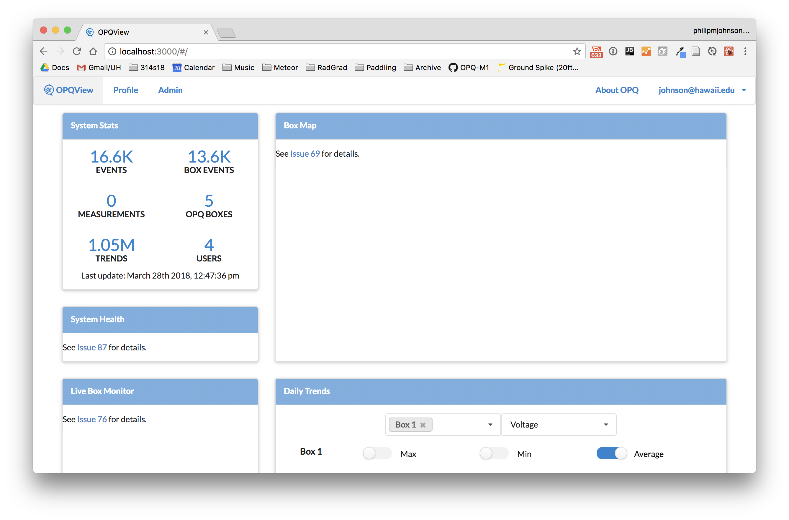

# OPQView Installation

This chapter explains how to install the OPQView system for development purposes. 

For instructions on how to install the system for deployment, see the [Deployment](../developerguide/deployment.md) chapter.

## Install Meteor {#install-meteor}

First, [install Meteor](https://www.meteor.com/install).


## Install libraries {#install-libraries}

Now [download a copy of OPQ](https://github.com/openpowerquality/opq/archive/master.zip), or clone it using git.
  
Next, cd into the opq/view/app/ directory and install libraries with:

```
$ meteor npm install
```

## Configure Settings {#configure-settings}

The 'start' script loads the settings file located in view/config/settings.development.json.  This file enables you to specify information about the authorized users of the system and the OPQ Boxes.  Currently, editing this file is the only way to manage user and OPQ Box meta-data.  The information about users and OPQ boxes is "upserted" each time the system is started. What this means is that you can edit the contents of the settings.development.json, then restart Meteor, and your changes to users and OPQ Boxes will take effect.  (You do not have to reset the Mongo database.)

Here is a simplified example of a settings.development.json file that illustrates its capabilities:

```
{
  "syncedCronLogging": false,
  "enableStartupIntegrityCheck": false,
  "integrityCheckCollections": ["fs.files", "fs.chunks"],
  "systemStatsUpdateIntervalSeconds": 10,
  "opqBoxes" : [
    { "box_id": "5", 
      "name": "Philip's Box", 
      "description": "Version 2.8, 2017", 
      "calibration_constant": 146.5,
      "locations": [
        {"start_time_ms": 1514844000000, 
         "zipcode": "96822", 
         "nickname": "CSDL Office" },
        {"start_time_ms": "2018-03-01 12:00:00", 
         "zipcode": "96734", 
         "nickname": "Kailua, HI (PJ)" }]
    }
  ],

  "userProfiles": [
    { "username": "johnson@hawaii.edu", 
      "password": "foo", 
      "firstName": "Philip", 
      "lastName": "Johnson", 
      "role": "admin", 
      "boxIds": ["1", "2", "3"]
    },
  ]
}
```

Here are the currently available properties:

| Property | Description |
| -- | -- |
| syncedCronLogging | System Stats are generated through a cron job.  This property should be true or false in order to indicate if logging information should be sent to the console. |
| enableStartupIntegrityCheck | This boolean indicates whether or not to check that the documents in the Mongo database conform to our data model. |
| integrityCheckCollections | This array specifies the Mongo collections to check if enableStartupIntegrityCheck is true. |
| opqBoxes | An array of objects, each object providing metadata about an OPQBox according to our data model.  Note that for convenience, the `start_time_ms` field in the locations subarray can be either a UTC millisecond value, or a string that can be parsed by Moment and converted to UTC milliseconds. The example above shows both possible ways of specifying the `start_time_ms`. |
| userProfiles | An array of objects, each object providing metadata about an authorized user of OPQView.  The role field can be either "admin" or "user". |

Note that a "production" settings file is used for deployment to emilia.  It has the same structure, but the actual file is not committed to github.  

## Use snapshot DB (optional) {#use-snapshot}

For OPQView development, it can be useful to initialize your development database with a snapshot of OPQ data. Here are the steps to do so. 

[Install MongoDB](https://docs.mongodb.com/manual/installation/).  Even though Meteor comes with a copy of Mongo, you will need to install MongoDB in order to run the mongorestore command.  

Download a snapshot of an OPQ database into a directory outside of the opq repository directory. (This is to avoid unintentional committing of the DB snapshot). Here are links to currently available snapshots:
 
   * [opq.dump.25jan2018.tar.bz2](https://drive.google.com/open?id=1qiq12WglZ3HdVCSskNH9uz2hNIZMICLe) (766 MB)
   * [opq.dump.20march2018.tar.gz](https://drive.google.com/open?id=1M1N_Z0w_BAlE5KoH0D0zUEcnjhCt7VK4) (3 GB)
   * [opq.dump.04Apr2018.tar.gz](https://drive.google.com/open?id=17bpF4c6KZFERlq1nW_GW6UDLBSdcyYGS) (3 GB)

Uncompress the downloaded tar.gz file. (Typically, double-clicking the file name will do the trick.) This will create a directory called "opq".

Delete the current contents of your local development OPQ database. To do this, stop Meteor if it is running, then invoke

```
meteor reset
```

Start meteor so that the development version of MongoDB is started. Do not run the 'start' script, just invoke `meteor`. This is to prevent OPQBoxes from being created twice:

```
meteor
```

Bring up a second command shell, then cd to the directory containing the "opq" snapshot directory, and run:

```
mongorestore -h 127.0.0.1 --port 3001 --gzip -d meteor opq
```

Here is an excerpt of the sample output from running the above command. It will take up to 10 minutes:

```
mongorestore -h 127.0.0.1 --port 3001 --gzip -d meteor opq
2018-01-29T14:50:49.999-1000	building a list of collections to restore from opq dir

                  (many lines deleted)

2018-01-29T14:53:01.999-1000	finished restoring meteor.fs.chunks (55639 documents)
2018-01-29T14:53:01.999-1000	done
```

Control-c to exit Meteor.  This is important, since you brought up Meteor without the settings file. 

## Use production DB (optional) {#use-production}

An alternative to loading a snapshot of the database into your local Mongo database is to connect directly to the Mongo database running on emilia.  This is good because you can, for example, test out real-time components on a database that is constantly receiving new data from boxes. It is bad because your development application now has the ability to mess up the production database.  Be careful.

Here are the steps to enabling your development version of OPQView utilize the production database on emilia:

#### 1. Obtain an account on emilia.ics.hawaii.edu

See Anthony who will provide you with the credentials.

#### 2. Forward emilia.ics.hawaii.edu:27017 to localhost:27017

Once you have an account on emilia, you can use ssh port forwarding to create a port on your local machine that acts as if it was the MongoDB port on emilia.  Open a new shell, and execute the following command:

```
$ ssh -C -p 29862 -N -L 27017:localhost:27017 user@emilia.ics.hawaii.edu
```

You'll need to replace `user` with your username on emilia, and you'll need to supply your password after executing this command. Once you successfully provide your password, port forwarding will have started.  When you no longer want port forwarding, you can control-c or close the shell. 

#### 3. Run OPQView, specifying an alternative MongoDB port

To run OPQView and connect to the database on emilia, invoke the following command:

```
$ MONGO_URL='mongodb://localhost:27017/opq' meteor npm run start 
```
This is simply the normal command to invoke OPQView (i.e. `meteor npm run start`, prefixed with the definition of the MONGO_URL environment variable specifying the port and database name associated with emilia.)

## Run OPQView {#run-opqview}

To start up OPQView on the local development database, run Meteor using our start script as follows:

```
meteor npm run start 
```

You should seem messages like this in the console:

```
$ meteor npm run start 

> opqview@ start /Users/philipjohnson/github/openpowerquality/opq/view/app
> meteor --settings ../config/settings.development.json

[[[[[ ~/github/openpowerquality/opq/view/app ]]]]]

=> Started proxy.                             
=> Started MongoDB.                           
I20180328-12:38:05.148(-10)? Starting SyncedCron to update System Stats every 10 seconds.
I20180328-12:38:05.207(-10)? Initializing 4 user profiles.
I20180328-12:38:05.207(-10)? Initializing 5 OPQ boxes.
=> Started your app.

=> App running at: http://localhost:3000/
```

You should be able to see the OPQView landing page at http://localhost:3000.  It looks like this:




 

