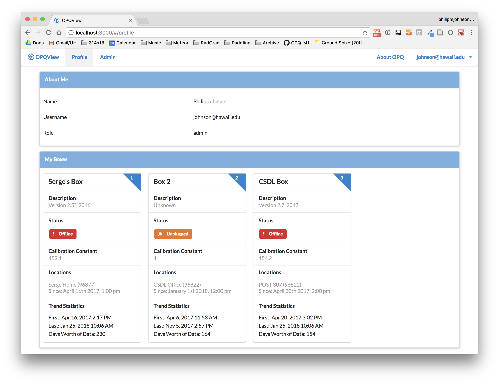
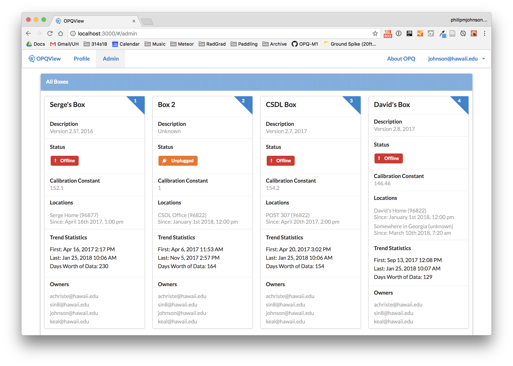
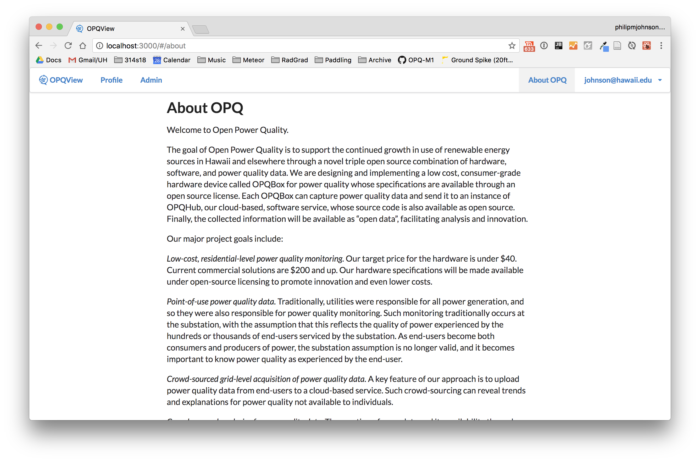
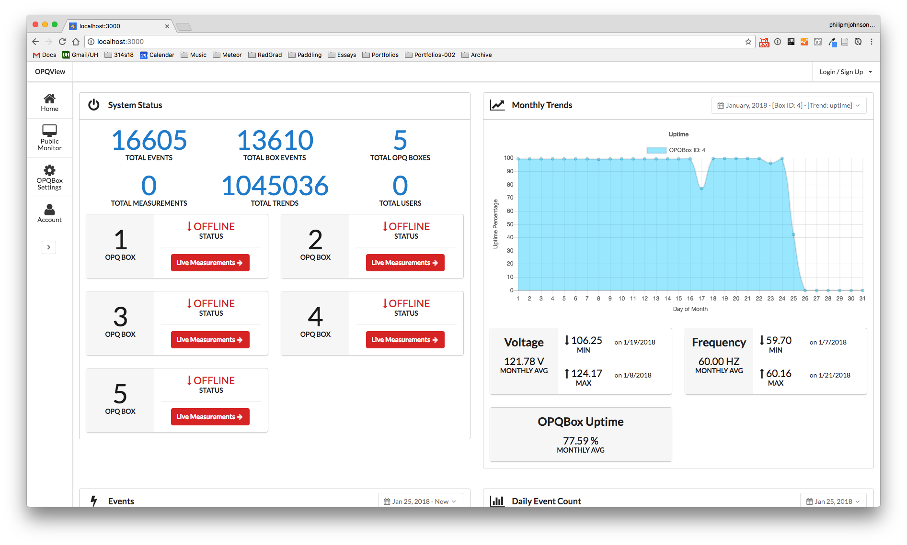

# OPQView User Guide

### Landing Page

The first OPQView page you normally encounter is the landing page, which currently looks like this: 


The landing page provides "public" data about the state of the OPQ system. It is public in the sense that anyone who can retrieve the top-level URL for OPQView can see this information without further authorization or authentication.  If you need this page to be private, please put the URL behind a firewall. 

### Profile Page

If you have login credentials for OPQ, you can login by clicking on the "Login" link in the upper right corner.  After logging in, all users will have a Profile page that can be accessed from the NavBar.  Here is an example of that page:



The profile page provides information about your account, as well as information about all of the OPQBoxes for which you are a designated "owner". Note that it is possible for a single box to have more than one OPQ owner. It is also possible for an OPQBox to not have an owner.  

### Admin Page

If your account has admin privileges, after logging in you will have access to an Admin page as well as a Profile page.  The admin page looks like this:



The Admin page provides information about every OPQ Box in the system, regardless of whether the user is an owner or not. It also indicates who is an owner of each OPQ Box.

### About Page

The About page provides some background information about OPQ.  You do not have to be logged in to see this page.  It looks like this:




### OPQView (Old Version)

BTW, the old version of OPQView has just a landing page, which looks like this:



## Port Forwarding MongoDB

To connect to a live MongoDB instance, we can utilize SSH port forwarding which will forward MongoDB's port on a remote computer to a port on your local machine. Here is an example of forwarding MongoDB from emilia.

```
ssh -C -p 29862 -N -L 27017:localhost:27017 user@emilia.ics.hawaii.edu
```

Here is a break down of the command:

* **-C** enables compression
* **-p 29862** tells SSH to connect on port 29862 rather than 22 (which ITS blocks)
* **-N** does not run a command after connecting to emilia (only perform port forwarding)
* **-L 27017:localhost:27017** Forward port 27017 on the remote server to port 27017 on the local host

When you're done using the port forwarding, you can exit with Ctrl-C.


 

